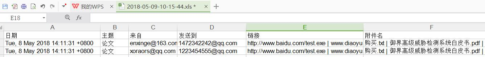

## eml文件解析  

> 解析 eml 文件并把结果保存到 excel 中

 

### 功能
- 解析 eml 文件，提取日期、主题、收发件人、正文链接、附件名信息
- 附件导出
- 附件名重复时加随机字符命名
- 提取邮件正文中所有 url
- 解析同目录下所有 eml 文件，结果写入excel文件中  

### 使用方法  
1. parseEml.exe 放在 eml 文件目录下，运行程序  
2. 安装依赖库，parseEml.py 放在 eml 文件目录下，运行脚本  

### 效果图  

