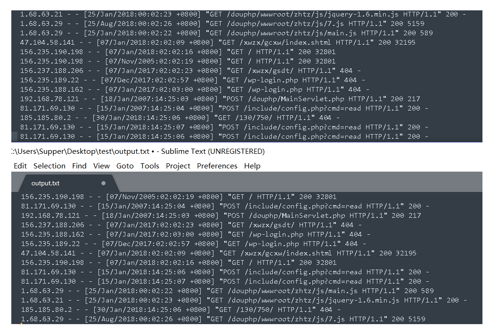
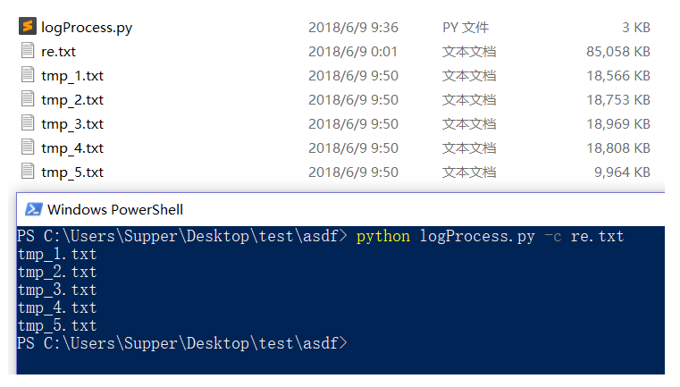

## 日志按时间顺序重排  

> 几个日志文件合并后想要按时间顺序重新排序，这里排序时用正则匹配时间转换为时间戳实现重排，根据自己需求改时间格式或匹配的字符串；编辑器处理大文件时会卡住所以要分割文件，文件分割后可以合并。

 

### 功能
- 按日志中的时间重排日志内容
- 自定义要匹配的内容
- 按行数分割文件  
- 合并以 txt 结尾的多个文件

### 使用方法  
1. 添加要处理的文件，运行脚本 

### 效果图  
  

## References
- [python进行拆分大文件](https://blog.csdn.net/IBoyMan/article/details/79419347)  

