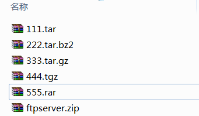
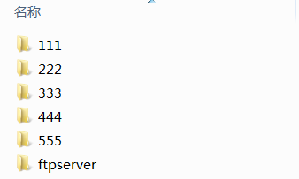
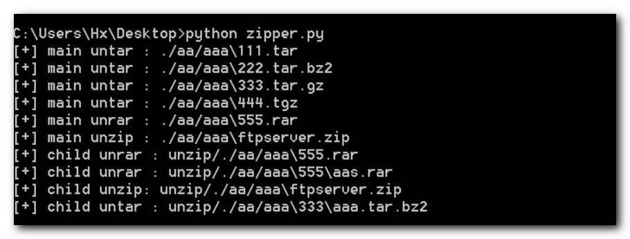

## 递归解压文件夹中所有压缩包

> 递归解压文件夹中的所有压缩包到指定文件夹

 

### 功能
+ 支持.zip .rar .tar .tgz .tar.gz .tar.bz2 .tar.bz .tar.tgz压缩包的递归解压

### 环境配置
如果要解压rar文件需要安装依赖库 [（python-unrar）](https://github.com/matiasb/python-unrar "python-unrar")  
  
*Windows*  
&ensp;&ensp;1. 在 RARLab 官方下载安装库文件[http://www.rarlab.com/rar/UnRARDLL.exe ](http://www.rarlab.com/rar/UnRARDLL.exe )  
&ensp;&ensp;2. 默认安装路径为 C:\Program Files (x86)\UnrarDLL\  
&ensp;&ensp;3. 添加环境变量 UNRAR_LIB_PATH 键值 C:\Program Files (x86)\UnrarDLL\x64\UnRAR64.dll，如果是32位就是 C:\Program Files (x86)\UnrarDLL\UnRAR.dll  
*Linux*
&ensp;&ensp;1. 下载库文件[https://www.rarlab.com/rar/unrarsrc-5.6.8.tar.gz](https://www.rarlab.com/rar/unrarsrc-5.6.8.tar.gz)  
&ensp;&ensp;2. `$ make lib
       $ make install-lib`  
&ensp;&ensp;3. 添加环境变量  export UNRAR_LIB_PATH=/usr/lib/libunrar.so  

### 效果图  

  

#### References
> [解决Python下安装unrar后仍然提示Couldn't find path to unrar library...](https://blog.csdn.net/ysy950803/article/details/52939708)